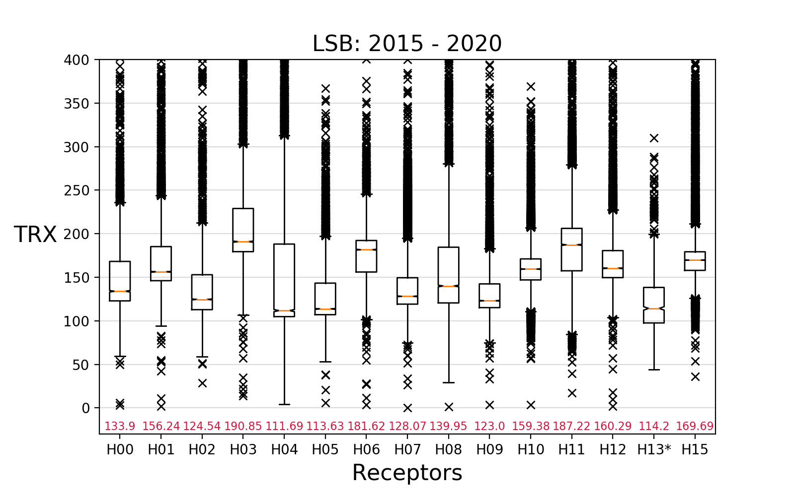
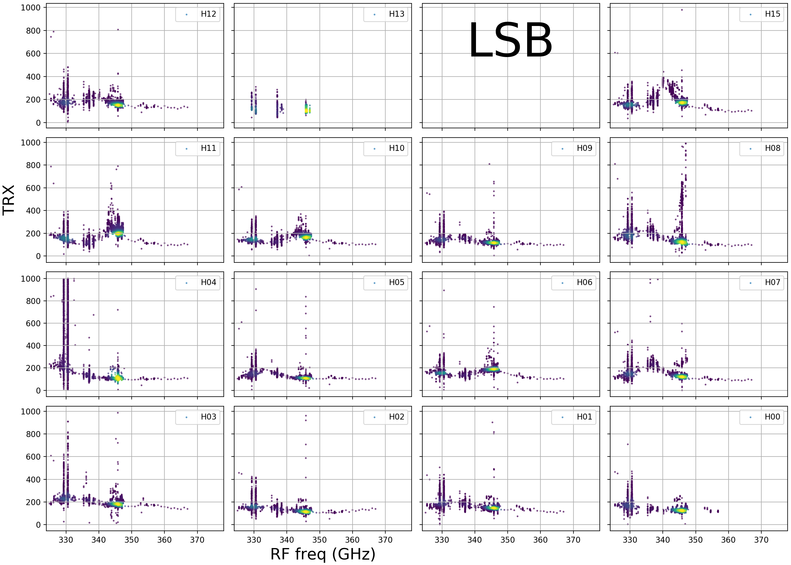
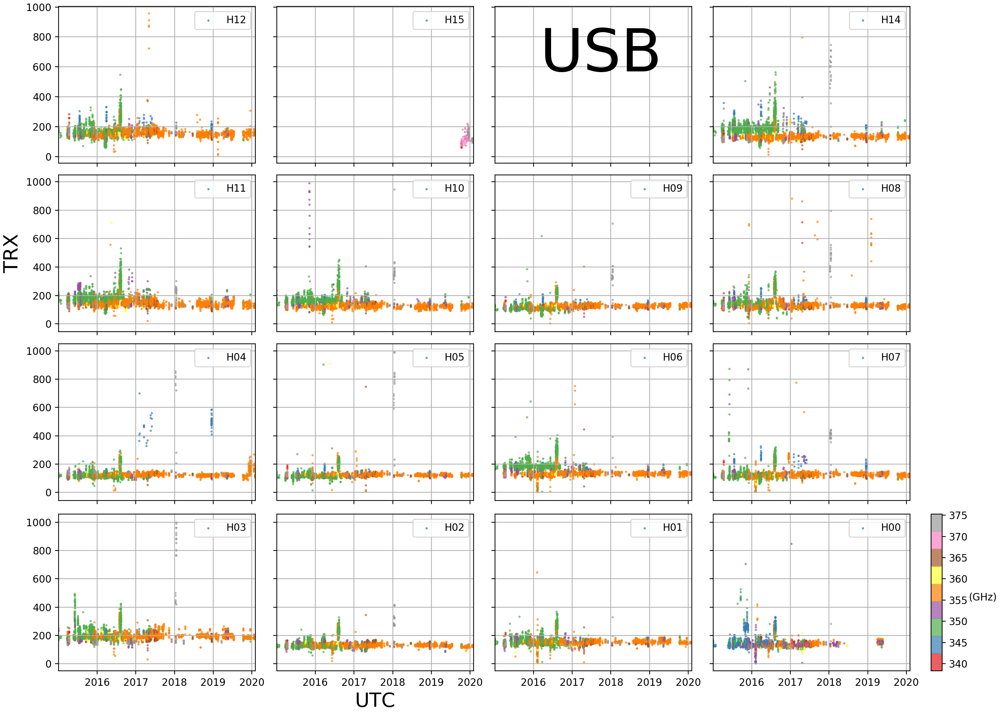

# Trx Statistical characteristics of HARP receptors
*Xue-Jian Jiang*, *Taishi Nammoto*, *Izumi Mizuno*

See [harp_trx.ipynb](harp_trx.ipynb) for more details

## 1. Each receptor's median TRX

## 2. Each receptor's TRX vs. Frequency

## 3. Each receptor's TRX vs. UTdate, color coded by frequencies.

## 4. Each receptor's TRX vs. UTdate (as of 20190401), color coded by frequencies. The arrows indicate 20191121 when the mixers of H04 and H13 were upgraded.

